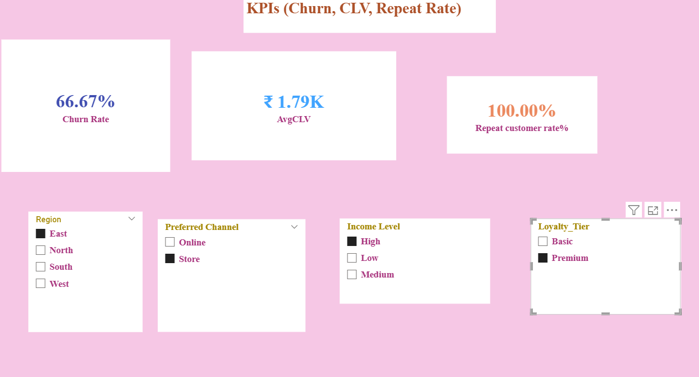
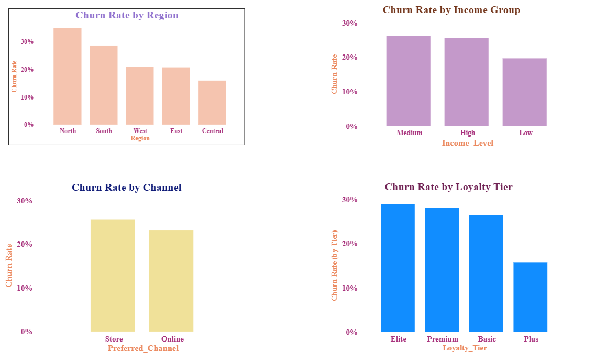
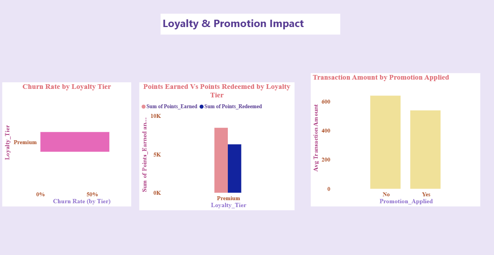
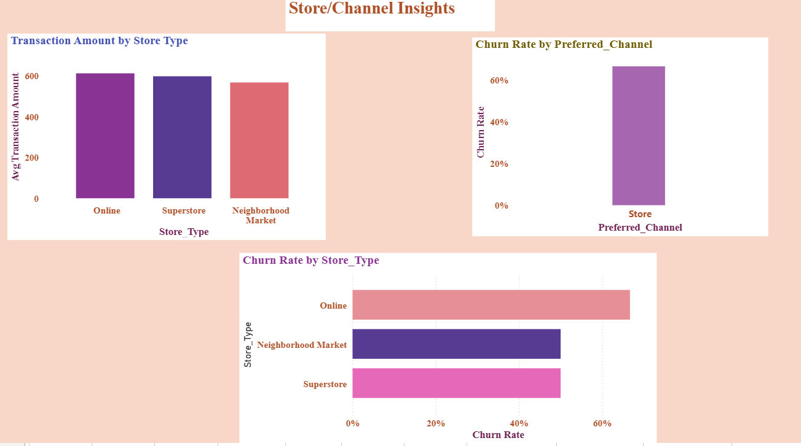
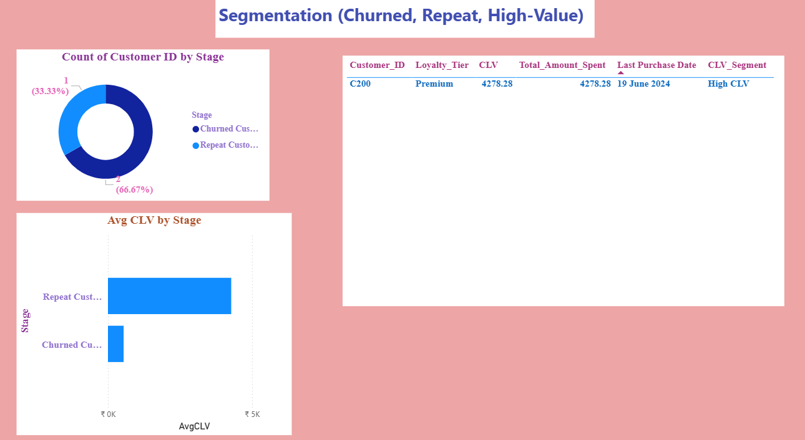
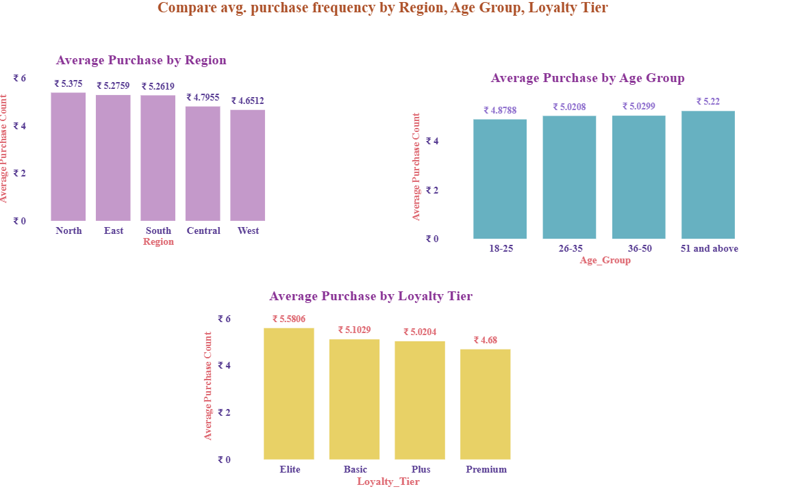
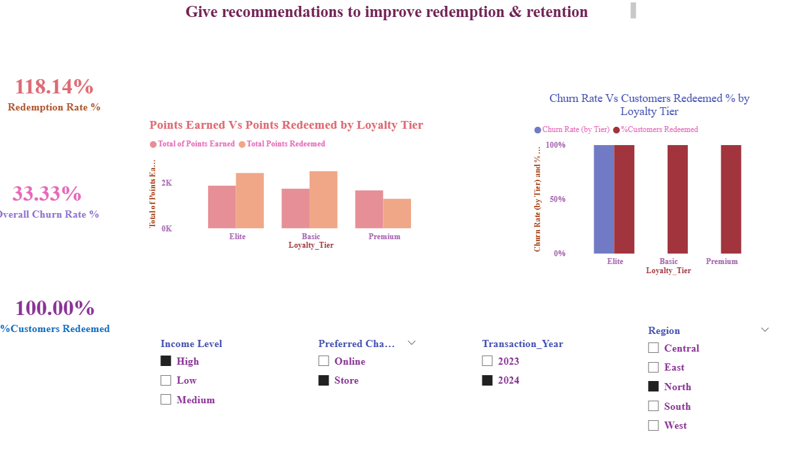

# 📊 Retail Customer Retention Analytics – TARGET  
### Power BI | Power Query | DAX | Customer Intelligence  

📍 Data Analytics Project | Business Intelligence | Retention Strategy  

---

## 📌 Project Overview

This project analyzes retail customer data to identify churn behavior, evaluate loyalty effectiveness, measure Customer Lifetime Value (CLV), and assess store/channel performance using Power BI.

The objective: **Improve customer retention and maximize long-term revenue through data-driven insights.**

---

## 📊 Key Analysis Areas

✔ Customer Segmentation & Demographics  
✔ Churn Rate & Retention Analysis  
✔ Loyalty Program Performance  
✔ Promotion Effectiveness  
✔ Store & Channel Insights  
✔ Customer Lifetime Value (CLV)  

---

## 📈 Major Insights

- Identified churn variation across loyalty tiers and regions  
- Detected higher churn in online channel  
- Found loyalty points redemption gap (engagement opportunity)  
- High CLV customers contribute significantly to revenue  
- Premium & Elite tiers still show churn risk  

---

## 📷 Dashboard & Visual Insights

### 📌 KPI Overview



- Churn Rate %
- Average CLV
- Repeat Customer Rate
- Interactive Slicers

---

### 📉 Churn Analysis



- Churn by Region  
- Churn by Loyalty Tier  
- Retention Rate Calculation  

---

### 🎁 Loyalty & Promotion Impact



- Points Earned vs Redeemed  
- Promotion vs Non-Promotion Spending  
- Tier-wise Performance  

---

### 🏬 Store & Channel Insights



- Avg Transaction by Store Type  
- Churn by Channel (Online vs Store)  
- Store Performance Comparison  

---

### 👥 Customer Segmentation & CLV



- High vs Low CLV Customers  
- Customer Stage Distribution  
- Churn Risk Identification  

---

### 💳 Purchase & Revenue Analysis



- Avg Purchase by Region  
- Avg Purchase by Loyalty Tier  

---

### 🔁 Redemption & Retention



- Loyalty Engagement vs Retention Impact  

---

## 🛠 Tools Used

- Power BI  
- Power Query  
- DAX  
- Data Modeling  
- KPI Reporting  
- Interactive Slicers  

---

## 📐 Key DAX Formula

```DAX
CLV = Total Amount Spent ÷ Membership Duration (Years)
```

---

## 🚀 Business Recommendations

- Prioritize High CLV & Repeat Customers  
- Strengthen Online Channel Experience  
- Simplify Loyalty Redemption Process  
- Target Inactive Premium & Elite Customers  

---

## 🎯 Business Impact

This dashboard enables:

- Early churn detection  
- Improved loyalty engagement  
- Better channel performance tracking  
- Revenue optimization through CLV analysis  

---

## 📁 Repository Structure

Customer-Retention-Project/
│
├── screenshots
├── CSV datasets
├── Power BI file (.pbix)
└── README.md
